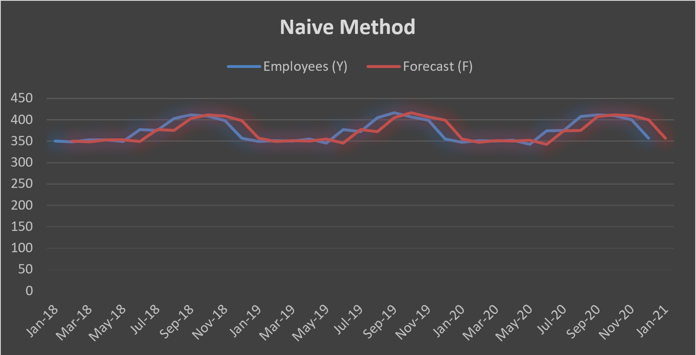
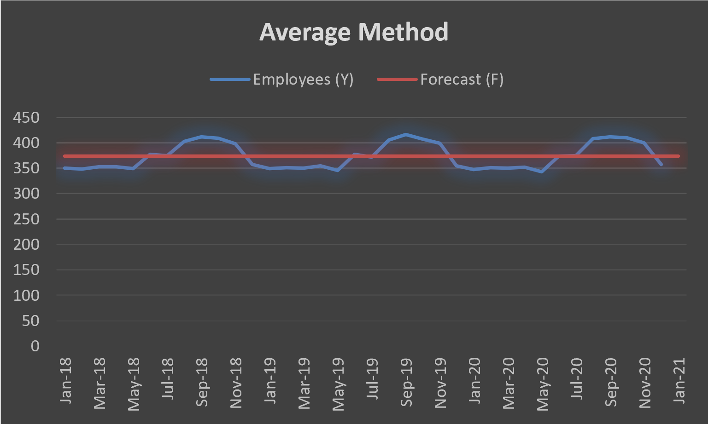
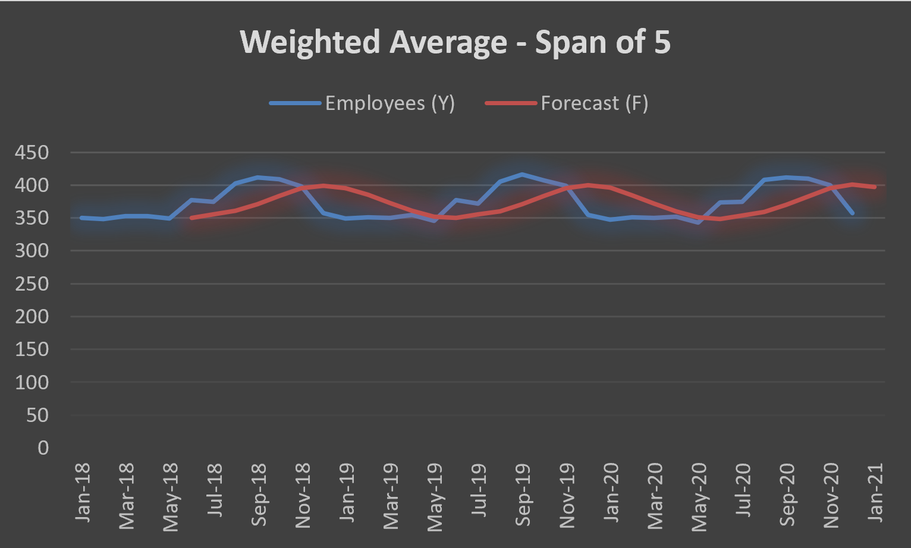
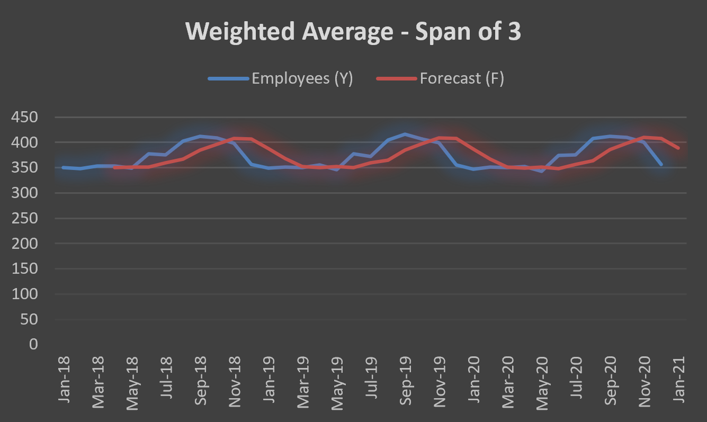

## 📈 Time Series Sales Forecasting (Excel)

This project demonstrates practical forecasting techniques using historical monthly employee data. Multiple forecasting models were built and compared to evaluate performance and prediction accuracy.

### 🔧 Tools Used
- Microsoft Excel
- Time series forecasting methods
- Error analysis (MAE, MSE, RMSE)

---

## 🔍 Forecasting Methods Compared

### 1️⃣ Naïve Method  
Assumes the next period equals the previous actual value. Useful as a baseline model.

---

### 2️⃣ Simple Average Method  
Uses the overall average of historical data to generate forecasts.

---

### 3️⃣ Weighted Moving Average (Span of 5)  
Applies weights to recent data points to better capture trends while smoothing fluctuations.

---

### 4️⃣ Weighted Moving Average (Span of 3)  
Places stronger emphasis on the most recent observations, making the model more responsive to changes.

---

## 📊 Model Evaluation

Forecast accuracy was measured using:

- **MAE (Mean Absolute Error)**  
- **MSE (Mean Squared Error)**  
- **RMSE (Root Mean Squared Error)**  

These metrics were used to compare model performance and determine which approach best balances stability and responsiveness.

---

## 💡 Business Insight

This project simulates real-world workforce planning or demand forecasting scenarios where organizations must:

- Identify trends over time  
- Compare forecasting strategies  
- Select models based on accuracy vs responsiveness  
- Translate numerical results into planning decisions  

This demonstrates applied forecasting skills used in **business analytics, operations planning, and financial analysis roles**.

