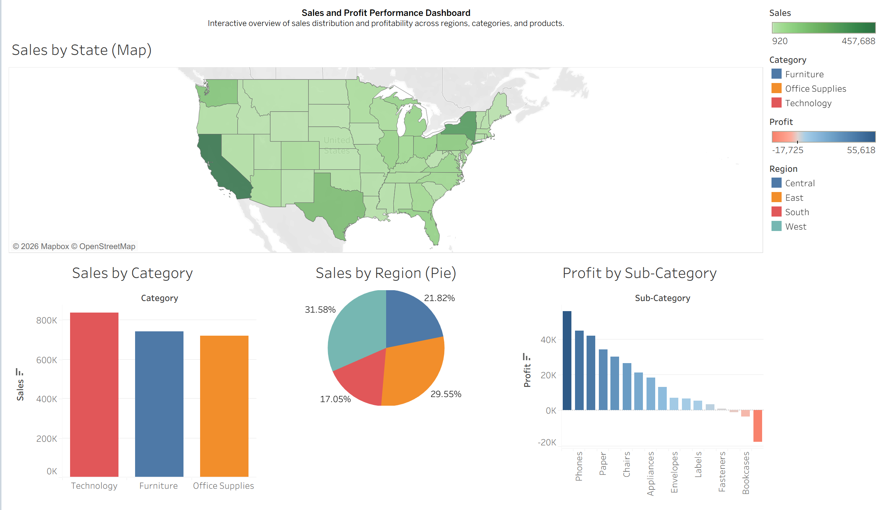
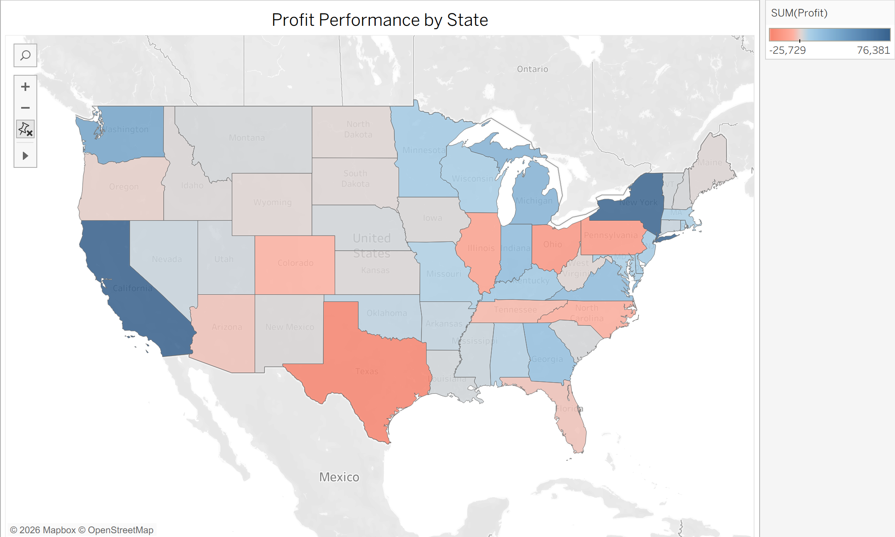
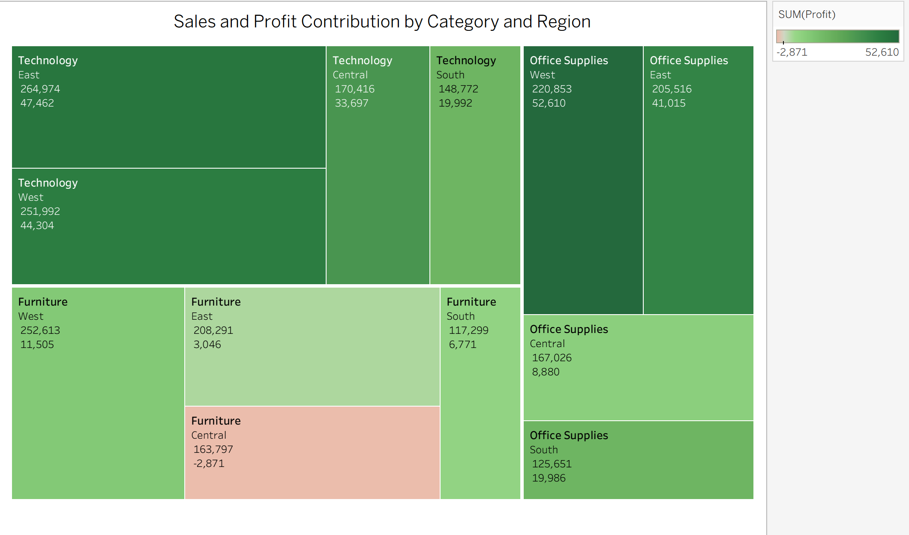

# Data Analytics Portfolio

This repository showcases selected analytics projects demonstrating skills in:

- Data visualization (Tableau)
- Data cleaning and analysis (R)
- Forecasting and time series analysis

Each project folder includes documentation explaining the goal, tools, and insights.

---

## Projects

### 📊 Tableau Dashboards
Business intelligence dashboards analyzing sales and profitability trends.

### 🧹 R Data Analysis
Data cleaning, transformation, and exploratory analysis using R.

### 📈 Forecasting Projects
Time series and predictive analysis projects.

## 📊 Dashboard Previews  

### Sales & Profit Performance Dashboard  

### Profit Performance by State  

### Sales & Profit Contribution Treemap  

